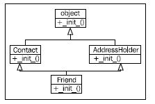
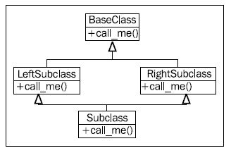
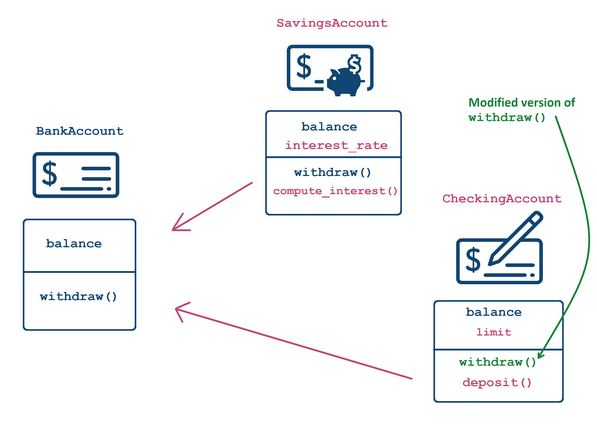

# Object-Oriented Python

Class lets us bundle behaviour and state together in an object.
- Behavior : function
- State    : variables

To use a class, we can create an object from it. This is known as Object instantiation.

- When we create objects from a class, each object shares the class's coded methods, but maintains its own copy of varaibles.
- The first argument to every method is always "self" and its value is supplied by the interpreter

### Constructor
- Construction `__init__()` method is called every time an object is created.

### Class-level data
- Data shared among all instances of a class. "Global variable" within the class.`MIN_SALARY` is shared among all instances.
- Dont use `self` to define class attribute and use `ClassName.ATTR_NAME` to access the class attribute value.

```python
class Employee:
	# define a class attribute
	MIN_SALARY = 30000 #<---no self
	def __init__(self, name, salary):
		self.name = name
		# use class name to access class attribute
		if salary >= Employee.MIN_SALARY:
			self.salary = salary
		else:
			self.salary = Employee.MIN_SALARY

	@classmethod
	def from_file(cls, filename):
		with open(filename, 'r') as f:
			name = f.readline()
		return cls(name)

emp = Employee.from_file("employee_data.txt")
```

### Class methods
- Methods are already shared : same code for every instance. Class methods cant use instance-level data.

```python
class MyClass:

	@classmethod                #<--use decorator to declare a class method
	def my_method(cls, args..): #<--cls argument refers to the class
		# execute
		# can't use any instance attributes
```

- To call a class method we use `MyClass.my_method(args...)` syntax rather then obj.my_method syntax.

#### Alternative constructors
- why would we ever need class methods at all? The main use case is `Alternative constructors`. A class can only have one __init__ method, but there might be multiple ways to initialize an object.
- For e.g, we might want to create a Employee object from data stored in a file, we can't use a method because that would require an instance and there isn't one yet.
- Here we introduce a class method `from_file` (refer above example) that accepts a filename, reads the firstname from the file that reads the name from file, name of the employee and returns an object instance. In the return statement `cls` is used. `cls` refers to the class. **This line will call the __init__ constructor just like calling Employee with the parenthesis**.
- Then we call the method `from_file` by using Class.method syntax which will create a Employee object without explicitly calling the constructor.

### Inheritance
- Code reuse. New class functionality = old class functionality + extra

```python
# implementening class inheritance
class MyChild(MyParent):
	# execute
```

#### Method inheritance
- Inheritance is powerful because it allows us to reuse and customize code without rewriting existing code. By calling methods of the parent class within the child class, we reuse all the code in those methods, making our code concise and manageable.

#### Inheritance of class methods
- To customize the parent's class method in a child class, start with a `@classmethod decorator`, and define a method with the same name in the child's class, just like we did with regular methods. The only difference is that to call the parent's class method within the child's method, we can use `ClassName.method_name(args...)` without passing `self` or `cls`.

### Customizing constructors

```python
class BankAccount:
	def __init__(self, balance):
		self.balance = balance

	def withdraw(self, amount):
		self.balance -= amount

class SavingsAccount(BankAccount):
	# constructor specifically for SavingsAccount with an additional parameter
	def __init__(self, balance, interest_rate):
		# call the parent constructor using ClassName.__init__()
		BankAccount.__init__(self, balance) # <--- self is a SavingsAccount but also a BankAccount
		# add more functionality
		self.interest_rate = interest_rate
		# construct the object using the new constructor
		acct = SavingsAccount(1000, 0.03)
		acct.interest_rate
```

- Can run constructor of the parent class first by `Parent.__init__(self, args...)`. We used `BankAccount.__init__(self, balance)` to tell Python to call the constructor from Parent class.
- `self` in this case is an savings account, that's the class we are in. In Python the instances of the subclass are also instances of parent class.

### Adding functionality
- Add methods as usual. Can use the data from both the parent and the child class.

```python
class SavingsAccount(BankAccount):
	def __init__(self, balance, interest_rate):
		BankAccount.__init__(self, balance)
		self.interest_rate = interest_rate

	# new functionality
	def compute_interest(self, n_periods=1):
		return self.balance * ((1 + self.interest_rate) ** n_periods - 1)
```

### Customizing functionality

```python
class CheckingAccount(BankAccount):
	def __init__(self, balance, limit):
		BankAccount.__init__(self, content)
		self.limit = limit

	def deposit(self, amount):
		self.balance += amount

	# new argument to withdraw fee
	def withdraw(self, amount, fee=0):
		# compare the fee to limit and then call parent withdraw method
		if fee <= self.limit:
			BankAccount.withdraw(self, amount - fee)
		else:
			BankAccount.withdraw(self, amount - limit)

check_acct = CheckingAccount(1000, 25)

# will call withdraw from CheckingAccount
check_acct.withdraw(200)

bank_acct = BankAccount(1000)

# will call withdraw from BankAccount # this is an application of polymorphism
bank_acct.withdraw(200)
```

- Notice that we can change the signature of the method in subclass by adding a parameter.
- Use `Parent.method(self, args...)` to call a method from the parent class.

```python
# Example
class CountFromBy:
    def increase(self) -> None:
        self.val += self.incr
```

- "self" is assigned the current object by the interpreter when a method is invoked, and that the interpreter expects each method's first argument to take this into account.

- Overriding is altering or replacing a method of the superclass with a new method(with the same name) in the subclass. No special syntax is needed to do this; the subclass's newly created method is automatically called instead of the superclass's method.

- super() function returns the object as an instance of the parent class, allowing us to call the parent method directly

- Multiple inheritance : A subclass that inherits from more than one parent class is able to access functionality from both of them. The simplest and the most useful form of multiple inheritance is called a mixin. A mixin is generally a superclass that is not meant to exists on its own, but is meant to be inherited by some other class to provide extra functionality.


```python
# Example
class Contact:
	#all_contacts = []
	all_contacts = ContactList()
	
	def __init__(self, name, email):
		self.name = name
		self.email = email
		#Contact.all_contacts.append(self)
		self.all_contacts.append(self)
        
 class MailSender:
	def send_mail(self, message):
		print("sending mail to " + self.email)
        
# multiple inheritance
class EmailableContact(Contact, MailSender):
	pass
```

The syntax for multiple inheritance looks like a parameter list in the class definition. Instead of including one base class insdie the parenthesis, we include two(or more) separated by a comma.

```
>>>e = EmailableContact("Test user ", "testuser@example.net")
>>>e.send_mail("hello, test email here")
Sending mail to testuser@example.net
```
- Multiple inheritance works all right when mixing methods from different classes, but it gets very messy when we have to work with calling methods on the superclass. Because there are multiple superclasses. How do we know which one to call? How do we know what order to call them in ?

### The Diamond Problem

- If we have two parent __init__ methods that both need to be initialized, and they need to initialized with different arguments. How do we do that? We can start with a naive approach:

```python
class Addressholder:
	def __init__(self, street, city, state, code):
		self.street = street
		self.city = city
		self.state = state
		self.code = code
	
class Friend(Contact, Addressholder):
	def __init__(self, name, email, phone, street, city, state, code):
		Contact.__init__(self, name, email)
		AddressHolder.__init__(self, street, city, state, code)
		self.phone = phone
```
In this example we directly call the __init__ function on each of the superclasses and explicitly pass the self argument. This example technically works;we can access the different varaibles directly on the class. But there are few problems.

1) There is a possibilty for a superclass to go uninitialized if we neglect to explicilty call the initializer .

2) Possibility of superclass being called multiple times, because of the organization of the class hierarchy. Inheritance diagram below.



The __init__ method from the Friend class first calls __init__ on Contact which implicitly initializes the object superclass( all classes derive from obejct). Friend then calls __init__ on AddressHolder, which implicitly initializes the object superclass again. The parent class has been setup twice. Imagine trying to connect to a database twice for every request! The base class should only be called once.

- Technically the order in which methods can be called can be adapted on the fly by modifying the __mro__ (Method resolution Order) attribute of the class.

Let's look at a second example that illustrates this problem more clearly. Here er have a base class that has a method named call_me. Two subclasses override that method, and then another subclass extends both of these using multiple inheritance. This is called diamond inheritance because of the diamond shape of the class diagram:



Diamonds are what makes multiple inheritance tricky. Technically, all multiple inheritance in Python3 is diamond inheritance, because all classes inherit from object.

```python
# Diamond problem

class BaseClass:
	num_base_calls = 0
	def call_me(self):
		print("Calling method on Base class")
		self.num_base_calls += 1
		
class LeftSubclass(BaseClass):
	num_left_calls = 0
	def call_me(self):
		BaseClass.call_me(self)
		print('Calling method on LeftSubclass')
		self.num_left_calls += 1
		
class RightSubclass(BaseClass):
	num_right_calls = 0
	def call_me(self):
		BaseClass.call_me(self)
		print('Calling method on RightSubclass')
		self.num_right_calls += 1
		
class Subclass(LeftSubclass, RightSubclass):
	num_sub_calls = 0
	def call_me(self):
		LeftSubclass.call_me(self)
		RightSubclass.call_me(self)
		print('Calling method on subclass')
		self.num_sub_calls += 1
```

```
>>> s = Subclass()
>>> s.call_me()
Calling method on Base Class
Calling method on Left Subclass
Calling method on Base Class
Calling method on Right Subclass
Calling method on Subclass
>>> print(s.num_sub_calls, s.num_left_calls, s.num_right_calls,
s.num_base_calls)
1 1 1 2
```
The base class's call_me method has been called twice.

- The thing to keep in mind with multiple inheritance is that we only want to call the "next" method in the class hierarchy, not the "parent" method. In fact, that next method may not be on a parent or ancestor of the current class.
- The "super" keyword comes to our rescue once again. Indeed, super was originally developed to make complicated forms of multiple inheritance possible. Here is the same code written using super:

```python
class BaseClass:
	num_base_calls = 0
	def call_me(self):
		print("calling method on Base Class")
		self.num_base_calls += 1
		
class LeftSubclass(BaseClass):
	num_left_calls = 0
	def call_me(self):
		super().call_me()
		print("Calling method on Left Subclass")
		self.num_left_calls += 1
		
class RightSubclass(BaseClass):
	num_right_calls = 0
	def call_me(self):
		super().call_me()
		print('Calling method on Right Subclass")
		self.num_right_calls += 1
		
class Subclass(LeftSubclass, RightSubclass):
	num_sub_calls = 0
	def call_me(self):
		super().call_me()
		print("Calling method on Subclass")
		self.num_sub_calls += 1
```

```
>>> s = Subclass()
>>> s.call_me()
Calling method on Base Class
Calling method on Right Subclass
Calling method on Left Subclass
Calling method on Subclass
>>> print(s.num_sub_calls, s.num_left_calls, s.num_right_calls,
s.num_base_calls)
1 1 1 1
```

- Base method is only called once. First call_me of Subclass calls super().call_me(), which happens to refer to LeftSubclass.call_me(). LeftSubclass.call_me() then calls super().call_me(), but in this case, super() is referring to RightSubclass.call_me()
- The super call is not calling the method on the superclass of LeftSubclass(which is Baseclass), it is calling the RightSubclass, even though it is not a parent of LeftSubclass! This is the next method, not the parent method. RightSubclass then calls BaseClass and the super calls have ensured each method in the class hierarchy is executed once.

### Operator overloading : comparison

#### Object Equality

```python
class Customer:
	def __init__(self, name, balance):
		self.name, self.balance = name, balance

customer1 = Customer("Maryam Azar", 3000)
customer2 = Customer("Maryam Azar", 3000)

customer1 == customer2  #<--- answer is False
```

- In this case it makes might sense, as we can have 2 customers with same name and acc balance. But what if the customer has a unique id number.Then 2 customers with same ID will be treated as equal, but they aren't.
- The reason why Python does'nt consider two objects with same data equal by default has to do with how the object and variables representing them are stored. If we try to just print the value of customer object, we can see different addresses.
- Python stores references to the data at these addresses. **So when we compare 2 objects we are comparing 2 references and not the data**. Bcz customer1 and customer2 points to different chunks in memory they are not considered equal. But it might not be the same in all cases.

#### Custom comparison

```python 
import numpy as np

# 2 different arrays containing the same data
array1 = np.array([1,2,3])
array2 = np.array([1,2,3])

array1 == array2 # <-- outputs : True # same with pandas DF and other objects
```

- How can we enfore this for custom classes? We can define a special method for this.

#### Overloading __eq__() (equality)
- `__eq__()` is called whenever 2 objects of a class are compared with each other using `==`.
- We can redefine this method to execute custom comparisons. The method should accept 2 argument referring to objects to be compared. They are usually called `self` and `other` by convention. Returns a boolean.
- When comparing two objects of a custom class using ==, Python by default compares just the object references, not the data contained in the objects. To override this behavior, the class can implement the special __eq__() method, which accepts two arguments -- the objects to be compared -- and returns True or False. This method will be implicitly called when two objects are compared.

```python
class Customer:
	def __init__(self, id, name):
		self.id, self.name = id, name

	# will be called when == is used
	def __eq__(self, other):
		# diagnostic printout
		print('__eq__() is called')

		# returns True if all attributes match
		return (self.id == other.id) and (self.name == other.name)
```

#### Other comparison operators
- `== : __eq__()` , `!= : __ne__()` , `>= : __ge__()`, `<= : __le__()`, `> : __gt__()`, `< : __lt__()`
- There is a `__hash__()` method that allows us to use objects as dictionary keys and in sets.

### Checking class equality
- We defined a BankAccount class with a number attribute that was used for comparison. But if we were to compare a BankAccount object to an object of another class that also has a number attribute, we could end up with unexpected results.

#### Consider two classes

```python
class Phone:
  def __init__(self, number):
     self.number = number

  def __eq__(self, other):
    return self.number == other.number

pn = Phone(873555333)

class BankAccount:
  def __init__(self, number):
     self.number = number

  def __eq__(self, other):
    return self.number == other.number

acct = BankAccount(873555333)
```

- Running `acct == pn` will return True, even though we're comparing a phone number with a bank account number. It is good practice to check the class of objects passed to the __eq__() method to make sure the comparison makes sense.
- Now only comparing objects of the same class BankAccount could return True. Another way to ensure that an object has the same type as you expect is to use the isinstance(obj, Class) function. This can helpful when handling inheritance, as Python considers an object to be an instance of both the parent and the child class.

### Comparison and inheritance
- What happens when an object is compared to an object of a child class? Consider the following two classes:

```python
class Parent:
    def __eq__(self, other):
        print("Parent's __eq__() called")
        return True

class Child(Parent):
    def __eq__(self, other):
        print("Child's __eq__() called")
        return True
```

- **Python always calls the child's __eq__() method when comparing a child object to a parent object.**

### Operator overloading : string representation

#### String representation of objects
- There are two special methods in Python that return a string representation of an object. __str__() is called when you use print() or str() on an object, and __repr__() is called when you use repr() on an object.

#### Printng an object
- We saw that printing object of custom class, prints the memory location of the object. But there are plenty of classes where the printout is much more informative.For e.g if we print a numpy array or dataframe, we will see the actual data contained in the object.
- There are 2 special methods that we can define in a class that will return a printable representation of an object.
- **`__str__()`** method is executed when we call **print(np.array([1,2,3])) or str(np.array([1,2,3]))** on an object. [print(obj), str(obj)]
- **`__repr__()`** method is executed when we call **repr** on an object. [repr(obj)]
- The difference is that `str` gives a informal representation (string representation), and `repr` is mainly used by developers. The best practise is to use `repr`, that can be used to reproduce the object.`repr` also used as fallback for print, when `str` is not defined.

#### Implementation : str
- It should'nt accept any argument besides `self` and it should return a `string`. If we now create a Customer object and print we will see a user friendly output.

```python
class Customer:
	def __init__(self, name, balance):
		self.name, self.balance = name, balance

	def __str__(self):
		cust_str = """
		Customer :
		name : {name}
		balance : {balance}
		""".format(name=self.name, balance=self.balance)
		return cust_str

cust = Customer("Maryam Azar", 3000)

# will implicitly call __str__()
print(cust)
```

### Implementation : repr
- Accepts one argument `self` and returns a `string`. repr is used to reproduce the object, in this case the exact initialization call.

```python
class Customer:
	def __init__(self, name, balance):
		self.name, self.balance = name, balance

	def __repr__(self):
		return "Customer('{name}', {balance})".format(name=self.name, balance=self.balance)

cust = Customer("Maryam Azar", 3000)
cust # <-- will implicilty call __repr__()
```

- **We should always define at least one of the string representation methods for out object to make sure that the person using our class can get important information about the object easily.**

### Exceptions
#### Exception handling
- use the `try` - `except` - `finally` code.

```python
try:
	# try running some code

except ExceptionNameHere:
	# run this code if ExceptionNameHere happends

except AnotherExceptionHere:
	# run this code if AnotherExceptionHere occurs

finally:
	# run this code no matter what
```

#### Exceptions are classes
- In python, exceptions are actually classes inherited from builtin classes, `BaseException` or `Exception`

#### Custom Exceptions
- To define custom exception, just define a class that inherits from built-in `Exception` class or one of its subclasses.
- Usually an empty class and inheritance alone is enough to ensure that python will treat this class as an Exception class.

```python
class BalanceError(Exception):
	pass

class Customer:
	def __init__(self, name, balance):
		if balance < 0:
			raise BalanceError("Balance has to be nonnegative")
		else:
			self.name, self.balance = name, balance
```

#### Catching custom exceptions
```python
try:
	cust = Customer("larry Torres", -100)
except BalanceError:
	cust = Customer("larry Torres", 0)
```

#### Handling exception hierarchies
-  It's better to list the except blocks in the increasing order of specificity, i.e. children before parents, otherwise the child exception will be called in the parent except block.

### Designing for inheritance and polymorphism

#### Polymorphism
- Using a unified interface to operate on objects of different classes.



- The BankAccount, SavingsAccount and CheckingAccount class has a withdraw method, but the ChecingAccount method is executing different code.

#### All that matters ia a interface
- Lets say we define a function to withdraw a same amount of money from whole list of accounts at once. The function doesn't care whether the objects passed to it are CheckingAccount, SavingsAccount or a mix. All that matters is that they have a withdraw method that accepts one argument that is enough to make the function work.
- It doesn't check which withdraw it should call the original or the modfied.When the withdraw method is actually called python will dynamically pull the correct method.
- Modified withdraw when the CheckingAccount is being processed and the base method when SavingsAccount or normal account is called.

```python
def batch_withdraw(list_of_accounts, amount):
	for acct in list_of_accounts:
		acct.withdraw(amount)

b, c, s = BankAccount(1000), CheckingAccount(2000), SavingsAccount(3000)
bacth_withdraw([b,c,s]) # <-- Will use BankAccount.withdraw(),
						# then CheckingAccount.withdraw(),
						# then SavingsAccount.withdraw()
```

- `batch_withdraw()` doesn't need to check the object to know which `withdraw()` to call

#### Liskov substitution principle
- There is a fundamental object oriented design principle of when and how to use inheritance properly called Liskov substitution principle : `Base class should be interchangeable with any of its subclasses without altering any properties of the program.
- That means wherever `BankAccount` works, `CheckingAccount` should work as well. For e.g `batch_withdraw` function worked regardless of what kind of account was used.

#### Violating LSP
- Syntactic incompatibility : `BankAccount.withdraw()` requires 1 parameter, but `CheckingAccount.withdraw()` requires 2
- Subclass strengthening input conditions : `BankAccount.withdraw()` accepts any amount, but `CheckingAccount.withdraw()` assumes that the amount is limited.
- Subclass weakening output conditions : `BankAccount.withdraw()` can only leave a positive balance or cause an error, `CheckingAccount.withdraw()` can leave balance negative.
- Changing addtional attributes in the subclass's method that were'nt changed in the base class.
- Throwing additional exceptions in subclass's method that base class did'nt throw.

#### No LSP - No Inheritance
- If the class hierarchy voilates the LSP, then we should not use inheritance bcz its likely to behave the code in unpredictable ways.


- Acknowledgement
Python 3 Object Oriented Programming by Dusty Phillips
