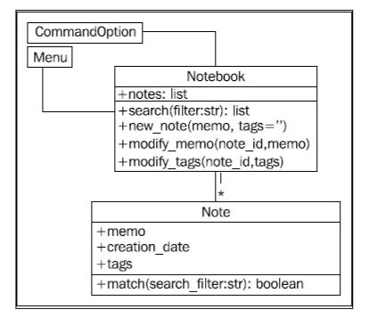

# Command-line notebook application

- Notes : Short memos stored in the notebook
- Each note should record the day it was written and can have tags added for easy querying
- It should be possible to modify notes
- We should be able to search the notes

